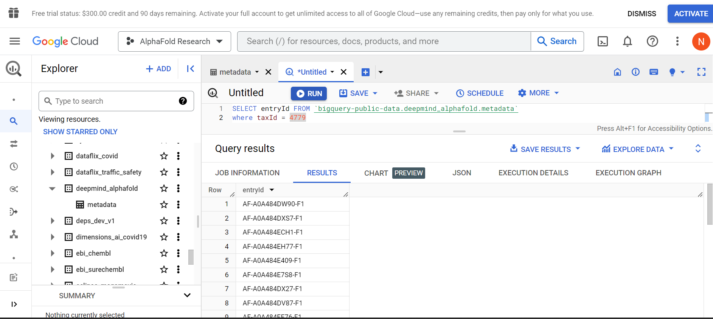

# AlphaFold Tests

## What AlphaFold2 Produces

TODO

## Papers to Cite

- Jumper, J et al. Highly accurate protein structure prediction with AlphaFold. Nature (2021).
- Varadi, M et al. AlphaFold Protein Structure Database: massively expanding the structural coverage of protein-sequence space with high-accuracy models. Nucleic Acids Research (2021).

## Useful Sources

- [Using AF in ChimeraX](https://www.youtube.com/watch?v=gIbCAcMDM7E&authuser=1)

## Experiments: Data and Results

### Figuring Out How to Gather Data from AlphaFold

(10/25/2023)

- ran AlphaFold2 Colab file on test sequences (found in data) similar to how I had run the data on ESMFold
  - made sure to omit the '*' at the end of the sequences
  - didn't touch anything in the Colab (just did 'Run All' like it says to do in the Colab)
- results found in 10/25/2023

#### Exploring Google Cloud and BigQuery

(11/1/2023)

- found some sequences in Uniprot that come from Bremia Lactucae. Apparently, Alphafold provides predicted structures for the sequences. Link: <https://www.uniprot.org/uniprotkb?query=(taxonomy_id:4779)>
- I created the fasta file `uniprotkb_taxonomy_id_4779_2023_11_01.fasta` by downloading a fasta file from the website above. The file lists all of the Bremia lactucae sequences found in the Uniprot database.
- I will use this to extract all of the Uniprot accession IDs so that I can download all of the AlphaFold predictions associated with Bremia lactucae.
- The predictions may be found in [this dataset on Google Cloud](https://console.cloud.google.com/storage/browser/public-datasets-deepmind-alphafold-v4;tab=objects?prefix=&forceOnObjectsSortingFiltering=false)

(11/2/2023)

I created a Google Cloud account and explored methods to get the AlphaFold sequences from the database. So far, this is what I've found:

- [Bremia lactucae's taxonomy ID is 4779](https://www.ncbi.nlm.nih.gov/Taxonomy/Browser/wwwtax.cgi?id=4779)
- The list of sequences can be found in the BigQuery metadata of the database
- You need to get a Google Cloud account in order to access BigQuery (means inputting credit/debit card info)
- **MAKE SURE YOU KNOW WHAT YOU'RE DOING W/ GOOGLE CLOUD**
  - costs can sneak up on you sometimes so make sure to not activate your account (permits payments to begin after the free trial) and, if you do need to activate it, set up budget alerts

(11/3/2023)

I used these steps provided by the [AlphaFold DB Github README.md repo](https://github.com/google-deepmind/alphafold/blob/main/afdb/README.md). So far, I successfully downloaded gsutil using [this guide](https://cloud.google.com/storage/docs/gsutil_install) and tried to make it work, but I need to figure out how to input my credentials as the provided gsutil code (`gsutil -m cp gs://public-datasets-deepmind-alphafold-v4/proteomes/proteome-tax_id-[TAX ID]-*_v4.tar .`) doesn't work.

I'll start looking more into the authentication stuff while also figuring out if I can access the database in other ways (ex: use the Uniprot list file).

Here is a screenshot of my SQL script in BigQuery where I managed to find all of the Bremia-lactucae AF results:



#### Getting Data Through Kelsey Instead

I downloaded the `alphafoldbulk.py` script that may help me download all of the sequences. Kelsey also sent me a bash script that is much simpler:

```bash
file=$1

while read -r line
do
  wget  "https://alphafold.ebi.ac.uk/files/"$line"-model_v4.pdb"
done <$file
```

She also gathered all of the data, so I will look into her directory later and grab all of the data. I might change this code later if I find a better way to specifically grab the Bremia lactucae related pdf files. For now, I will just grab the data she had gathered. I kept the data in the git-untracked `AF_db_data` directory in the lab server (kept it there because it is very large).

(11/6/2023)

I created a script that detects if the data produced by Kelsey had all the entry IDs extracted from BigQuery. It seems like some of the entry IDs were not found.

**TODO:** figure out what happened to these missing entry IDs.

### Linking ORFs for B_lac-SF5 and AF predicted sequences thru BLAST (11/6/2023 --> updated 11/15/2023)

(11/6/2023 --> updated 11/15/2023)

Here is the link for grabbing the [AlphaFold metadata from BigQuery](https://console.cloud.google.com/bigquery?p=bigquery-public-data&d=deepmind_alphafold&page=dataset&project=woven-precept-403918&ws=!1m4!1m3!3m2!1sbigquery-public-data!2sdeepmind_alphafold).

#### Gathering Data

I created a SQL script in BigQuery that creates the protein sequences that relate to an AF entry ID. The script is below. The output of this SQL entry is `af_entry-ids_uniprot-seqs_for_blac-sf5.csv`. To fact-check that the correct csv file is being used, remember that the number of Bremia lactucae sequences in uniprot is 8951 (remember to check lines to ensure the right files are being used).

 After analyzing the output of the resulting csv file, I found that the entryId was the same as the uniprotId with an `AF-` at the front and other stuff after it. To use the csv file to produce the BLASTp result, I converted the csv into a tsv file called `af-uniprot-id_uniprot-seq.no_headers.tsv` that only has the AF IDs and uniprot sequences from the csv file. Then, I produced a FASTA file called `af-uniprot-id_uniprot-seq.fasta` using the Python script `convert_tsv_to_fasta.py`. Here is the SQL script that produced the csv file:

```SQL
select entryId, uniprotId, uniprotSequence from `bigquery-public-data.deepmind_alphafold.metadata`
where taxId = 4779
```

Kelsey gave me this script that will help determine which sequences are related to each other via BLASTp:

'''text
blastp -query [query.fasta] -db [db.fasta] -evalue 1e-10 -outfmt "6 std qcovs" -out [name]

database = all Bremia lactucae ORFs
query=uniprot sequences with alphafold

output = table of best hits
'''

I used `af-uniprot-id_uniprot-seq.fasta` as my query fasta file and `B_lac-SF5.protein.fasta` as my database fasta file. In order to use the database fasta file, I need to convert it into a BLASTp database. To do this, I am using the `makeblastdb` command. Information on this command can be found on the [NIH website](https://www.ncbi.nlm.nih.gov/books/NBK569841/). The website example uses a taxId map text file; however, it may be difficult to do so.

This is the error code that ran when I didn't create a database from the database FASTA file first:

```text
BLAST Database error: No alias or index file found for protein database [B_lac-SF5.protein.fasta] in search path [/share/rwmwork/nsanc/kelsey_work/ml-on-effectors/alphafold-tests/data/2023_11_1-6::]
```

This is the command I ran in order to make the database (I ended up having to run this again on 11/15/2023 in the date's data directory):

```bash
makeblastdb -in B_lac-SF5.protein.fasta -title "Bremia Lactucae ORF Sequences" -dbtype prot > B_lac-SF5_db_creation.log

## INFO:
# -in           : input FASTA file
# -title        : BLAST database title
# -dbtype prot  : makes database a protein type
```

The status content is logged in `B_lac-SF5_db_creation.log` (remember to set the output of makeblastdb to a .log next time), Here's what it can look like:

```text
Building a new DB, current time: 11/06/2023 18:03:03
New DB name:   /share/rwmwork/nsanc/kelsey_work/ml-on-effectors/alphafold-tests/data/2023_11_1-6/B_lac-SF5.protein.fasta
New DB title:  Bremia Lactucae ORF Sequences
Sequence type: Protein
Keep Linkouts: T
Keep MBits: T
Maximum file size: 1000000000B
Adding sequences from FASTA; added 105272 sequences in 7.52235 seconds.
```

I am running a script I called `blastp_q_on_ORFs.sh` where the inputs are:

- $1: input query FASTA file
- $2: input database FASTA file
- $3: output filename

and the script runs BLASTp. Here is the command:

```bash
blastp -query af-uniprot-id_uniprot-seq.fasta -db /share/rwmwork/nsanc/kelsey_work/ml-on-effectors/alphafold-tests/data/2023_11_1-6/B_lac-SF5.protein.fasta -evalue 1e-10 -outfmt "6 std qcovs" -out blastp_output.txt
```

And here is the script (as I had used on 11/15/2023 in the date's data directory):

```bash
./blastp_q_on_ORFs.sh af-uniprot-id_uniprot-seq.fasta /share/rwmwork/nsanc/kelsey_work/ml-on-effectors/alphafold-tests/data/2023_11_15/B_lac-SF5.protein.fasta blastp_output_db_B_lac-SF5_q_blac-uniprot.txt
```

#### Results

Here is a 3-line sample of what the file ends up looking like. By the way, for clarity, I renamed `blastp_output.txt` to `blastp_output_db_B_lac-SF5_q_blac-uniprot.txt` (update 11/15/2023: I just made the output file name as this which is more efficient anyways). I referenced what the columns are through [this website about BLAST output format 6](https://pascal-martin.netlify.app/post/blastn-output-format-6/). Just a warning, it takes a decent amount of time for blastp to produce a result so I would recommend (if running on its own rather than through a pipeline) to run it in the background or dedicate a screen to it.

### Analyzing Predited AF Sequences w/ EffectorO Prediction, RXLR, WY, CRN, SP, ... (11/8/2023 - )

#### Linking Uniprot IDs and ORFs (deprecated)

(11/8/2023 --> deprecated w/ 11/13/2023 stuff)

To analyze the AlphaFold sequences, I am creating a table that links Uniprot Accession IDs to their ORF sequence counterparts. For this, I am going to use the `awk` command on the file `blastp_output_db_B_lac-SF5_q_blac-uniprot.txt` through the CLI. The result is in a file called `uniprot-id_to_ORF-blac-seq.txt`. Here is the code:

```bash
awk -F' ' '{print $1"\t"$2}' blastp_output_db_B_lac-SF5_q_blac-uniprot.txt > uniprot-id_to_ORF-blac-seq.txt
```

After creating the table, I want to make sure that each uniprot ID has a unique associated ORF. Here is the code I wrote to do this:

```bash
awk -F' ' '{print $2}' uniprot-id_to_ORF-blac-seq.txt | uniq -c | sort | grep -v -e 1 > count_num_duplicate_ORFs.txt
```

I found that there are many sequences that have more than one associated uniprot ID.

To extract the uniprot IDs associated with each ORF, I am developing a bash script called `identify_duplicate_ORFs.sh` that will go through `blastp_output_db_B_lac-SF5_q_blac-uniprot.txt`, extract the lines associated with any duplicate ORF, and create a new blastp file that does not contain any duplicate ORFs. The resulting outputs will be called `blastp_output_db_B_lac-SF5_q_blac-uniprot.duplicate_uniprot-ids.txt` and `blastp_output_db_B_lac-SF5_q_blac-uniprot.unique_uniprot-ids.txt` to contain duplicate and unique ORF lines respectively. Here are the input parameters for the bash script:

- $1: input BLASTp result
- $2: input list of duplicate ORFs
- $3: output duplicate ORFs filename
- $4: output unique ORFs filename

This is how I am running the script:

```bash
# removing count column from duplicate ORFs file
cat count_num_duplicate_ORFs.txt | awk -F' ' '{print $2}' > duplicate_ORFs.txt

./identify_duplicate_ORFs.sh blastp_output_db_B_lac-SF5_q_blac-uniprot.txt duplicate_ORFs.txt blastp_output_db_B_lac-SF5_q_blac-uniprot.duplicate_uniprot-ids.txt blastp_output_db_B_lac-SF5_q_blac-uniprot.unique_uniprot-ids.txt
```

note: `uniprot-id_to_ORF-blac-seq.removed_duplicates.txt` will have a line at the beginning like this:

```text
### blastp output with only duplicate ORFs
```

If this file is read later, make sure to deal with this line.

#### Creating the Table

To create the table, I am going to use the `pandas` module in Python. For this, I am creating a conda environment meant to be used for all projects on the ml-on-effectors repo. The `environment.yml` will be placed at the root of the repo. I want to use the latest Python because I feel like it, so the environment will run on Python 3.12 (hopefully this doesn't run into any issues in the future).

(11/9/2023)

I am creating a Python script called `create_uniprot-id_table.py` that determines if a uniprot ID is associated with:

- ORFs with >= 0.85 effector prediction
- WY
- RXLR
- CRN
- SP
- and more when I evaluate other classifications

In order to create an ORF list with the >=0.85 predicted effectors, I ran this command on the FASTA file associated with it:

```bash
grep -Po '>(\w+)' predicted_blac-SF5_effectors_filtered_L0.85.fasta | cut -c 2- > predicted_blac-SF5_effectors_filtered_L0.85.list_of_ORFs.fasta
```

I will be using the whole BLASTp output rather than just the uniprot IDs with unique ORFs first. Here is the command I will be using:

```bash
python3 create_uniprot-id_table.py uniprot-id_to_ORF-blac-seq.txt RXLR_and_EER IDs_rxlr_and_eer.tab CRNs blac-sf5-v8-crns.txt SP sp_B_lac-SF5.filterlist.txt WY_Domain wy_cleaved_sp_B_lac-SF5.protein.fasta ov0.85_predicted predicted_blac-SF5_effectors_filtered_L0.85.list_of_ORFs.fasta
```

(11/13/2023)

Kelsey said that there is a better way to filter the BLASTp output to give the best possible hit. Here is the code she provided in addition to this:

```R
WYs=read.table("results_allWYs_with_names.tab", sep="\t", stringsAsFactors=F, comment.char="", header=F)
names(WYs) = c("qseqid", "sseqid", "pident", "length", "mismatch", "gapopen", "qstart", "qend", "sstart", "send", "evalue", "bitscore","qcovs")
#sort by percent identity so you can get the best hit for each gene
order_WYs = WYs[order(-WYs$pident),]
#remove duplicates - this keeps the first instance which will be higher since they were sorted
uniq_hpw = order_WYs[!duplicated(order_WYs$qseqid),]
```

I rewrote some names of variables in the code for generalization and also allowed for the user to input their own BLASTp file (requires `optparse`).

Also, based on Kelsey's recommendation, I changed the Python script `create_uniprot-id_table.py` so that there are no spaces in column names. This only affected "Uniprot ID" and "ORF Sequence" (converted to "Uniprot_ID" and "ORF_Sequence" respectively).

(11/14/2023)

I edited the R script given to me by Kelsey (now called `tabularize_blastp_output.r`) to produce a table that provides the best hits for all the AF uniprot sequences. The following command was used:

```bash
Rscript tabularize_blastp_output.r -i blastp_output_db_B_lac-SF5_q_blac-uniprot.txt
```

The resulting output file from this code is called `blastp_output_db_B_lac-SF5_q_blac-uniprot.filtered_best_hits.txt`.

note: I ran the following code to double check if the ORF IDs were truly unique in the new file and it ended up being true:

```bash
cat blastp_output_db_B_lac-SF5_q_blac-uniprot.filtered_best_hits.txt | tail -n +2 | awk -F'\t' '{print $2}' | uniq -c | less
```

I also created a new version of `create_uniprot-id_table.py` called `create_ORF-id_table.py` to represent the new table structure that Kelsey wants. In this new structure, the table headers are ordered as follows:

|ORF_sequence_ID|RXLR_EER|CRN_motif|SP|WY_Domain|effectorO_score|best_blast_hit_AF_ID|pident|length|mismatch|gapopen|qstart|qend|sstart|send|evalue|bitscore|qcovs|
|---------------|--------|---------|--|---------|---------------|--------------------|------|------|--------|-------|------|----|------|----|------|--------|-----|
|...............|........|.........|..|.........|...............|....................|......|......|........|.......|......|....|......|....|......|........|.....|

(11/15/2023)

I realized that I used the wrong AF sequence ID fasta file! I redid my process from 11/6/2023 (see above). I am running everything up to the stuff previosly and then talk to Kelsey about these results (should be pretty fast since I've got the general pipeline down). Here's the code that I ran for `create_ORF-ID_table.py`. As of now the code doesn't include RXLR-EER since there needs to be some analysis still, but I'll deal with it tomorrow.

```bash
python3 create_ORF-ID_table.py -i blastp_output_db_B_lac-SF5_q_blac-uniprot.filtered_best_hits.txt -f wy_cleaved_sp_B_lac-SF5.protein.fasta sp_B_lac-SF5.filterlist.txt blac-sf5-v8-crns.txt predicted_blac-SF5_effectors_filtered_L0.85.list_of_ORFs.fasta
```

The resulting TSV file is named `blastp_output_db_B_lac-SF5_q_blac-uniprot_on_WY-Domain_SP_CRN-motif_predicted-effectors-ov-85.tsv`.

Just for personal reference, there are many ways to get the data from this TSV file. Here are some command examples:

- determining what AF-uniprot IDs could be associated w/ ORF classifications

```bash
cat blastp_output_db_B_lac-SF5_q_blac-uniprot_on_WY-Domain_SP_CRN-motif_predicted-effectors-ov-85.tsv | awk -F'\t' '{print $1 "\t" $14 "\t" $15 "\t" $16}' | less
```

- checking what AF-uniprot IDs are associated w/ WY Domains

```bash
cat q_blac-uniprot_on_WY-Domain_SP_CRN-motif_predicted-effectors-ov-85.tsv | awk -F'\t' '$14=="1" {print $1 "\t" $14 "\t" $15 "\t" $16}'
| less
```
