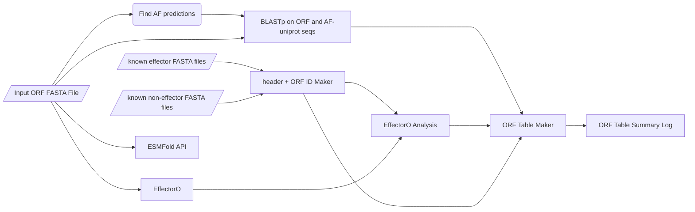

# ML-ON-EFFECTORS PIPELINES

## Analyzing by ORF Sequence IDs

```mermaid
flowchart LR
BLASTP[BLASTp on ORF and AF-uniprot seqs]
E[EffectorO]
EA[EffectorO Analysis]
FAP(Find AF predictions)
HNO[header + ORF ID Maker]
IFF[/Input ORF FASTA File/]
KE[/known effector FASTA files/]
KNE[/known non-effector FASTA files/]
OTM[ORF Table Maker]
OSL[ORF Table Summary Log]
ESMA[ESMFold API]

IFF --> FAP
FAP --> BLASTP
IFF --> BLASTP

HNO --> EA

KE --> HNO
KNE --> HNO

BLASTP --> OTM
IFF --> E ---> EA ---> OTM
HNO --> OTM

OTM --> OSL

IFF --> ESMA
```
